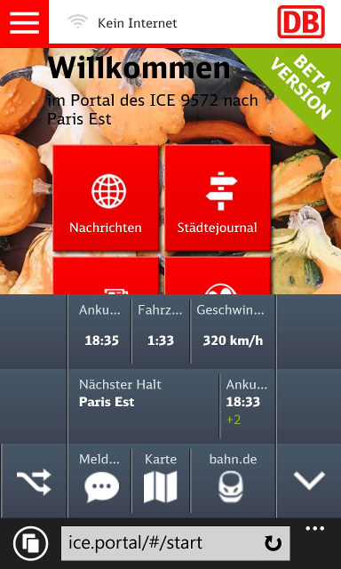

# ICE data tracker

Records information from "inflight" information system in DB ICE trains (publicly available). This information includes:

* current speed
* current time
* current position (longitude, latitude)
* connection status to internet

amongst even more. This is what the original application looks like on a phone:

This program requests the data in a given frequency (default: every 5 seconds) and both shows information on the terminal and records it in a .csv file.

## Getting the source

    $ go get github.com/kiesel/ice-tracker

## Running

In $GOPATH/src/github.com/kiesel/ice-tracker:

    $ go run track.go 

## About

This program was written while riding the ICE train to Paris (and back) on 2016-10-09 & -11 in order to attend at [DotGo EU 2016](http://dotgo.eu/)